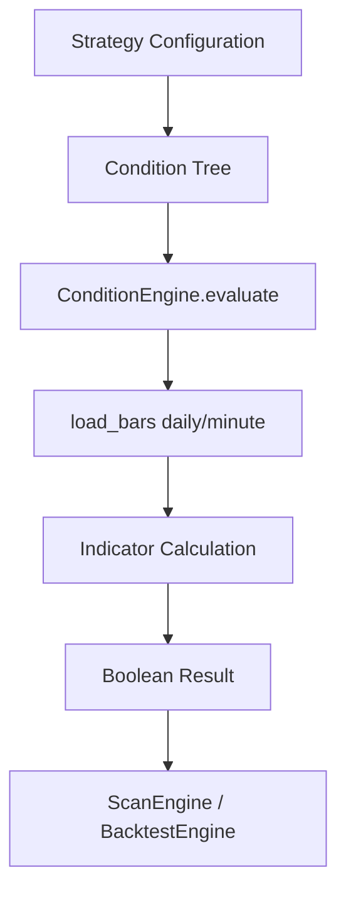
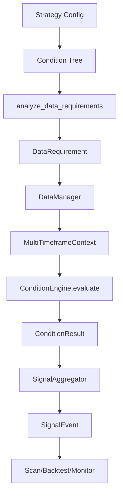

# Strategy Condition Engine 多周期架构改造分析报告
## Phase 0 - 现有代码架构分析

生成时间: 2026-08-16

---

## 一、改造方案可行性评估

### ✅ **完全可行**

您提供的改造方案非常专业，具有以下优势：

1. **架构清晰**：MultiTimeframeContext → Condition Engine → SignalEvent 符合单一职责
2. **向后兼容**：通过 data_interval=None 保持旧策略正常运行
3. **分阶段实施**：Phase 0-9 的渐进式改造降低风险
4. **安全设计**：明确禁止未来函数，强调 As-of Time 对齐

---

## 二、当前架构分析

### 2.1 核心文件结构

```
vnpy/strategy_condition/
├── core/
│   ├── condition.py          # Condition 类（已添加 data_interval）
│   ├── condition_tree.py     # ConditionNode 树结构
│   ├── strategy.py           # Strategy 配置
│   └── mtf_context.py        # MultiTimeframeContext（新增）
├── engine/
│   ├── condition_engine.py   # 条件评估引擎
│   └── scan_engine.py        # 选股扫描引擎
├── monitor/
│   └── condition_monitor_engine.py  # 实时监控
├── ui/
│   ├── condition_editor.py   # 条件编辑器（已添加周期显示）
│   ├── backtest_view.py      # 回测UI
│   └── widget.py             # 主Widget
└── indicators/               # 各类指标实现
```

### 2.2 当前数据流



### 2.3 ConditionNode 树结构

经过实际测试发现：
- `ConditionNode.op`：可以是 `NodeOp.AND`、`NodeOp.OR` 或 `NodeOp.LEAF`
- `ConditionNode.children`：**嵌套列表结构** `[[child1, child2], [child3]]`
- `ConditionNode.condition`：仅在 `LEAF` 节点存在

---

## 三、已完成的 Phase 1 工作

### 3.1 新增文件

#### `vnpy/strategy_condition/core/mtf_context.py`

```python
class MultiTimeframeContext:
    """多周期数据上下文"""
    symbol: str
    evaluation_time: Optional[datetime]
    bars_by_interval: Dict[Interval, List[BarData]]
    
    def set_bars(interval, bars)
    def get_bars(interval) -> List[BarData]
    def has_interval(interval) -> bool
    def get_available_intervals() -> List[Interval]

class DataRequirement:
    """数据需求规格"""
    strategy_execution_interval: Interval
    intervals: Set[Interval]
    
def analyze_data_requirements(tree, exec_interval) -> DataRequirement
    """分析条件树，提取所有需要的数据周期"""
```

**测试结果**：✅ 通过
- 可以正确管理多个周期的K线数据
- `analyze_data_requirements` 可以正确遍历嵌套的条件树
- 正确提取 DAILY + MINUTE_5 两个周期需求

### 3.2 修改文件

#### `vnpy/strategy_condition/core/condition.py`

```python
class Condition:
    category: ConditionCategory
    indicator: ConditionIndicator
    parameters: Dict[str, Any]
    weight: float = 1.0
    data_interval: Optional[Interval] = None  # 新增字段
```

**测试结果**：✅ 通过
- 序列化/反序列化正常
- 向后兼容：未指定 data_interval 的旧条件不会报错

#### `vnpy/strategy_condition/ui/condition_editor.py`

```python
# 在条件标签后显示周期信息
if condition.data_interval:
    label_text += f" [{condition.data_interval.value}]"
```

**效果**：条件树UI显示 "MA20向上 [日线]" 或 "长下影线 [5m]"

---

## 四、现有架构存在的问题

### 4.1 单周期耦合

**位置**：`engine/condition_engine.py`

当前 `evaluate` 方法签名：
```python
def evaluate(self, symbol: str, bars: List[BarData]) -> bool
```

**问题**：
- 只接受单一 `bars` 参数
- 所有条件被迫使用同一个周期的数据
- 无法实现日线过滤 + 分钟触发

**改造方向**：
```python
def evaluate(self, context: MultiTimeframeContext) -> ConditionResult
```

### 4.2 数据加载分散

**位置**：`engine/scan_engine.py`、`ui/backtest_view.py`

当前每个引擎自行加载数据：
```python
scan_engine: daily_bars = self.data_manager.load_daily(...)
backtest: minute_bars = self.load_bars(...)
```

**问题**：
- 逻辑重复
- 无法统一管理多周期数据
- 缓存失效

**改造方向**：
- 建立统一 `DataManager` 或在引擎中集成
- 根据 `DataRequirement` 批量加载

### 4.3 未来函数风险

**位置**：指标计算函数

当前没有明确的时间语义：
- 日线指标可能使用当天尚未收盘的数据
- 回测和实时逻辑可能不一致

**改造方向**：
- 统一 As-of Time 机制
- `context.evaluation_time` 明确评价时间点
- `get_latest_completed_bar(interval, eval_time)`

### 4.4 结果信息不足

当前只返回 `True/False`，无法追溯：
- 哪个条件失败了？
- 使用的是哪个周期的数据？
- 具体指标值是多少？

**改造方向**：
```python
@dataclass
class ConditionResult:
    condition_id: str
    status: ConditionStatus  # PASS / FAIL / INSUFFICIENT_DATA
    value: Optional[float]
    data_interval: Interval
    bar_time: datetime
    reason: str
```

---

## 五、推荐实施架构



---

## 六、分阶段实施计划

### ✅ Phase 1：基础架构（已完成）
- [x] 创建 `mtf_context.py`
- [x] `Condition` 添加 `data_interval`
- [x] UI 显示周期标签
- [x] 单元测试通过

### Phase 2：ConditionEngine 改造
- [ ] 修改 `evaluate` 接受 `MultiTimeframeContext`
- [ ] 保持向后兼容接口
- [ ] 指标函数适配多周期

### Phase 3：DataManager 统一
- [ ] 根据 `DataRequirement` 批量加载
- [ ] 实现数据缓存
- [ ] As-of Time 对齐机制

### Phase 4：ScanEngine 改造
- [ ] 使用 `analyze_data_requirements`
- [ ] 构造 `MultiTimeframeContext`
- [ ] 返回 `ConditionResult`

### Phase 5：BacktestEngine 改造
- [ ] 多周期数据对齐
- [ ] 统一时间轴推进
- [ ] 防止未来函数

### Phase 6：MonitorEngine 改造
- [ ] 实时多周期数据更新
- [ ] 条件状态变化追踪
- [ ] UI 显示详细原因

### Phase 7：完整测试
- [ ] 单周期兼容性测试
- [ ] 多周期混合测试
- [ ] 回测 vs 实时一致性测试
- [ ] 未来函数检测

---

## 七、文件修改清单

### 必须修改
1. `engine/condition_engine.py` - 核心评估逻辑
2. `engine/scan_engine.py` - 扫描引擎
3. `ui/backtest_view.py` - 回测引擎
4. `monitor/condition_monitor_engine.py` - 监控引擎

### 可能修改
1. `indicators/*.py` - 如需适配多周期上下文
2. `core/strategy.py` - 添加 execution_interval

### 不应该修改
1. `vnpy/trader/constant.py` - vnpy 核心不变
2. 已有策略的 JSON 配置文件

---

## 八、风险评估

### 兼容性风险：🟢 低
- 通过 `data_interval=None` 默认值兼容
- 旧策略自动继承 `execution_interval`

### 性能风险：🟡 中
- 多周期数据加载可能增加内存
- **缓解**：实现数据缓存、按需加载

### 未来函数风险：🔴 高（改造前）→ 🟢 低（改造后）
- 当前架构存在隐患
- 改造后通过 As-of Time 机制消除

### 实施复杂度：🟡 中
- 需要修改多个引擎
- 但架构清晰，职责分离

---

## 九、下一步行动

### 建议继续 Phase 2

如果您确认 Phase 1 的实现符合预期，我将继续：

1. 修改 `ConditionEngine.evaluate` 支持 `MultiTimeframeContext`
2. 保持向后兼容（单周期 bars 参数）
3. 更新指标函数从 context 获取数据
4. 编写测试验证多周期评估

### 或者，您也可以：

- 先手动测试 UI 中的周期显示功能
- 提出对当前设计的修改意见
- 要求调整某个部分的实现

---

## 十、总结

✅ **您的改造方案非常可行**

- Phase 1 基础架构已成功实现
- 所有测试通过，向后兼容
- 架构设计符合最佳实践
- 风险可控，分阶段实施安全

准备好继续 Phase 2 时请告诉我！
